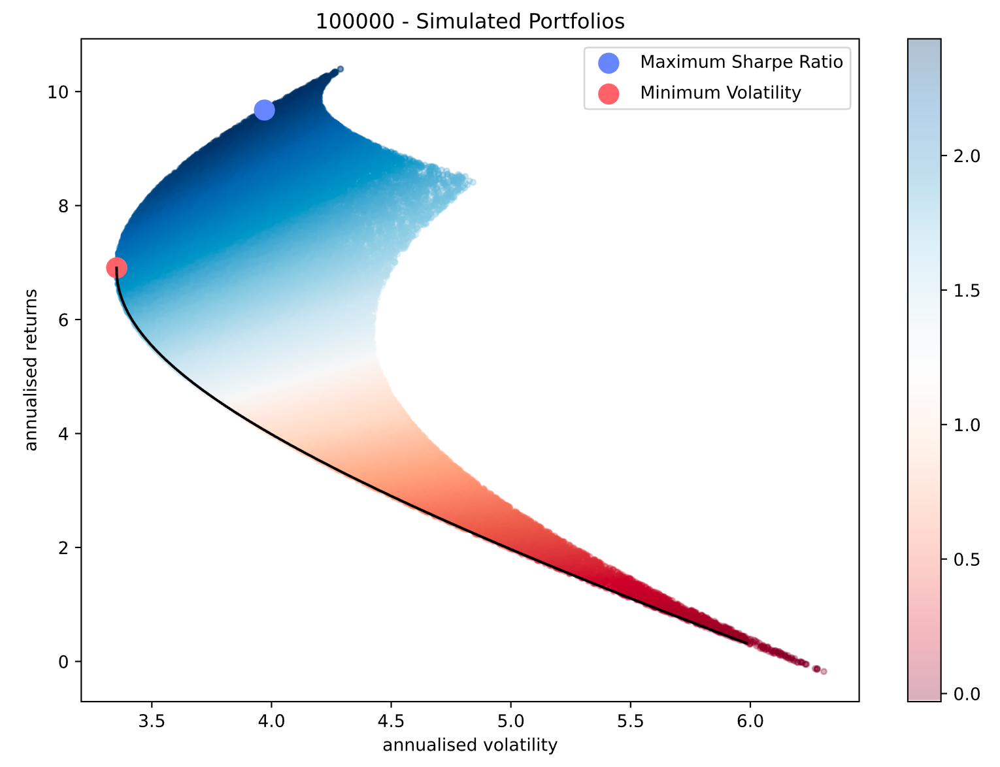

# Markowitz Portfolios

An implementation of MPT in Python, provided notebook walks through using the functions in `MPT.py` and sample data is available in the `data` dir. 

MPT is typically used to determine optimal allocations for a given set of assets over some historical timeframe, a novel addition in this repo to the traditional theory is the use of MPT to **SELECT** assets from a given set. Basically running forward selection to find the best combination of assets and allocations within that set. 

Big Thanks to Ricky Kim for original inspiration- https://towardsdatascience.com/efficient-frontier-portfolio-optimisation-in-python-e7844051e7f

